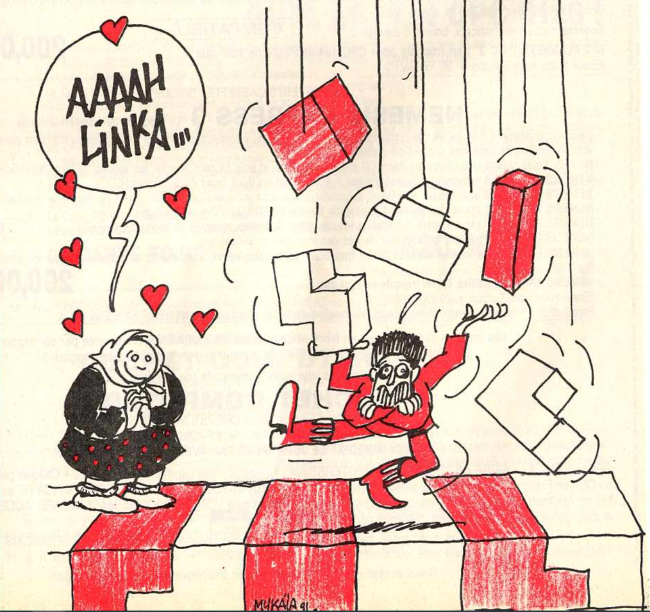
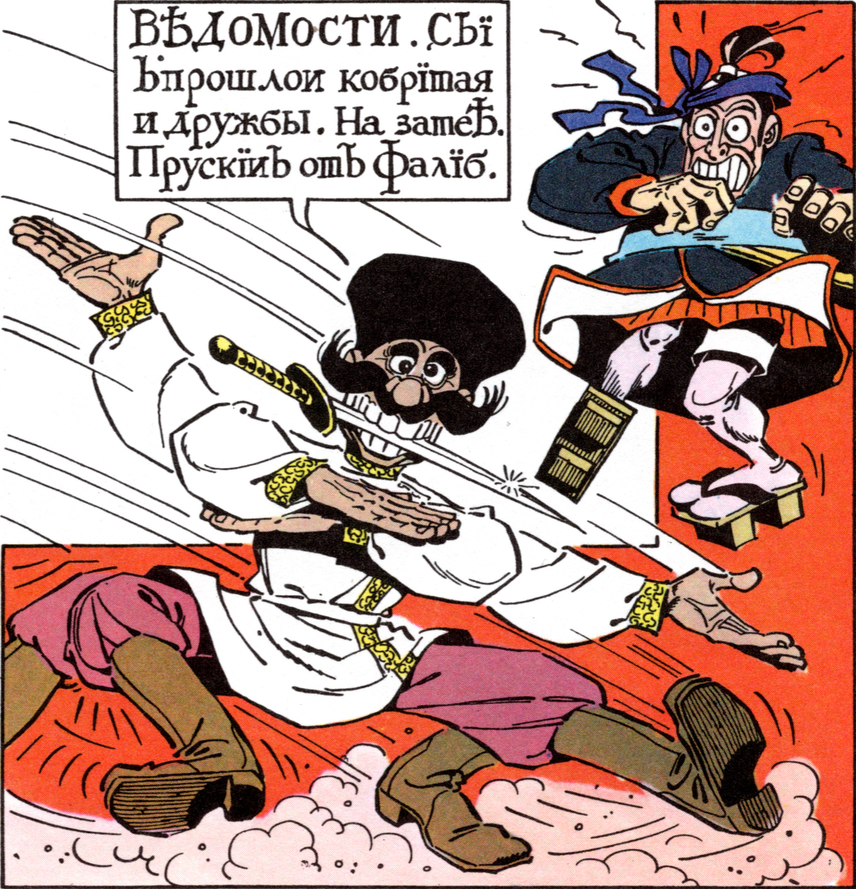

# Alinka

N'ayant malheureusement pas conservé les sources du tout premier jeu que j'avais écrit en assembleur, il y a fort fort longtemps, je me lance dans le désassemblage du binaire...

Je ne retomberai évidemment pas sur le code source original, avec ses commentaires et ses conventions de nommage, mais cela me donnera quand même un bon aperçu de ce que j'avais pu pondre comme code à l'époque (j'avais à peine 18 ans), sans formation, et sans internet...
Juste à l'aide de bouquins, de magazines et certainement beaucoup de persévérance :-)

## AAaahh-linka !!!!

Initialement, Alinka, ne s'appelait pas Alinka. En fait, Alinka n'avait même pas de nom et je n'avais pas codé ce Tetris pour qu'il soit publié un jour.

En 1989, j'avais 17 ans et je passais beaucoup de temps avec les copains au CDI du lycée. Il y avait le babyfoot, un flipper, une borne d'arcade et la patronne, euh la surveillante, s'appelait Annie.  
Bon ok, en fait, on trainait pas mal au bar le Saint Germain, juste à côté du lycée Champollion.  
Et il y avait forcement compet' de Tetris. Avec Sylvain, Patrice, Xavier, le frangin et les autres, on enquillait les parties et au final on y laissait tout notre argent de poche.

Alors, pour m'entrainer en douce et ne laisser aucune chance aux potes, je me suis dit que je n'avais qu'à me programmer un Tetris sur l’Amstrad CPC6128 familiale.  
Je m'étais déjà lancé à la découverte de la programmation, avec "les bidouilles d'Amstrad 100%", "la bible du programmeur de l'Amstrad CPC" et "les clés pour Amstrad - Système de base" ; Alors la glorieuse perspective de devenir le roi du Tetris du Saint Ger', me donna la motivation supplémentaire pour me lancer dans l'aventure.

Fin 1989, j'avais enfin une version "arcade" de Tetris qui tournait sur mon Amstrad. Mais c'était une version d'entrainement, sans aucune fioriture, ni gameplay, ni hiscore. Juste des briques qui tombent et des niveaux qui s'enchainent...  
Mais bon c'était mon objectif et j'y étais parvenu, alors j'étais content.

C'est là, que mon cousin Thibault de passage à Grenoble, m'annonce qu'il a dégotté un stage à "Amstrad Cent pour Cent" et qu'il pourrait en profiter pour leur montrer ce Tétris et, qui sait, peut-être qu'ils pourraient le publier.

C'est comme ça que mon programme est arrivé dans les lecteurs de diskette de la rédac d'Amstrad Cent pour Cent.
Quelques temps plus tard, ils me contactent pour me dire qu'ils seraient prêts à publier le jeu sous forme de listing, mais qu'il faudrait d'abord que je l'habille un peu avec une présentation, un menu, de la musique, etc, etc...

Euh oui, bon d'accord, mais euh bon... je vais voir ce que je peux faire...

Je ne pouvais évidemment pas l'appeler "Tetris" ; les gens auraient tout de suite vu que j'avais plagié ;-)

Du coup j'ai dû faire appel à toute ma créativité:  
- La musique originale de Tetris est inspirée d'une musique qui s'appelle Kalinka, et il y avait Aline, une p'tite nana de 1ère littéraire, qui ne me laissait pas indifférent !!!
Alors bam, je m'suis dit "Alinka", ça c'est super comme nom !!!  
- Et puis il y avait David qui lui tournait aussi autour, donc hop, on aura qu'a dire qu'il y a des soupirants qui essayent de la séduire pour conquérir son coeur !!!
- Pour la musique, ben j'ai plus ou moins reproduit Kalinka.
- Pour les graphiques, j'ai honteusement pompé sur le Kozak dans les "Rubrique à brac" de Gotlib.
- Et je crois que le visage d'Alinka vient d'une photo N&B de Grace Kelly.  

Bref, que de l'original :-)))

Il m'a fallu de longs mois pour packager tout ça et j'envoie la version finale à Amstrad Cent pour Cent en Septembre 1990.

Alinka est publié début 1991 !!!

Bon au final, mes rêves de gloiiiiiireeeuuuuu ont fait pschiitt:
- Aline s'est maquée avec David (qui n'etait même pas dans les hiscores de Tetris...)
- Tetris a été remplacé par Arkanoïd au Saint Ger' (et non, je ne me suis pas lancé dans le remake d'Arkanoid...;-) )

Du coup je me suis consolé avec les 1000 Francs et l'imprimante matricielle dernier cri avec module scanner, que m'avait rapporté ce jeu :-))

